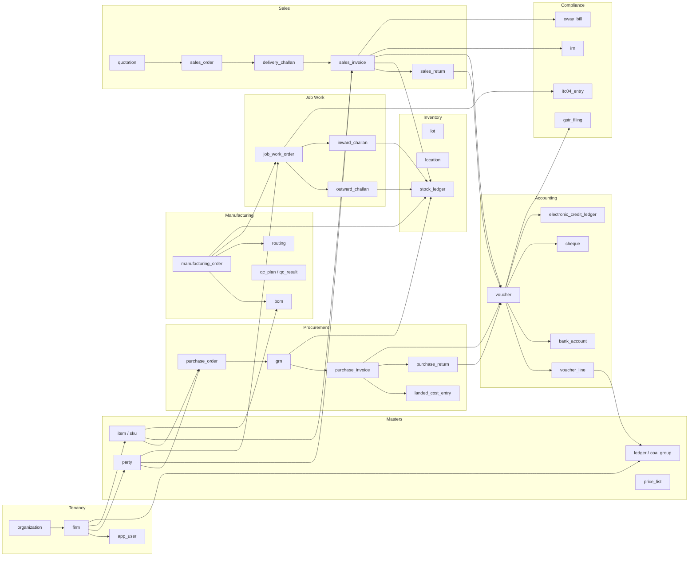
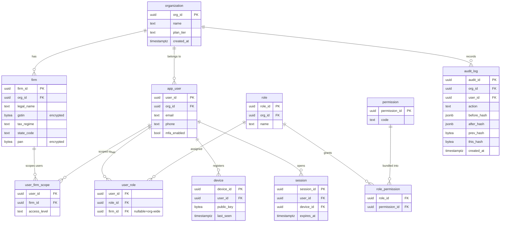
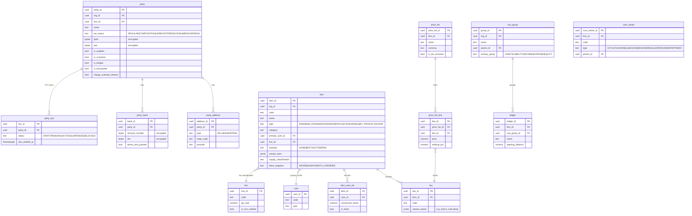
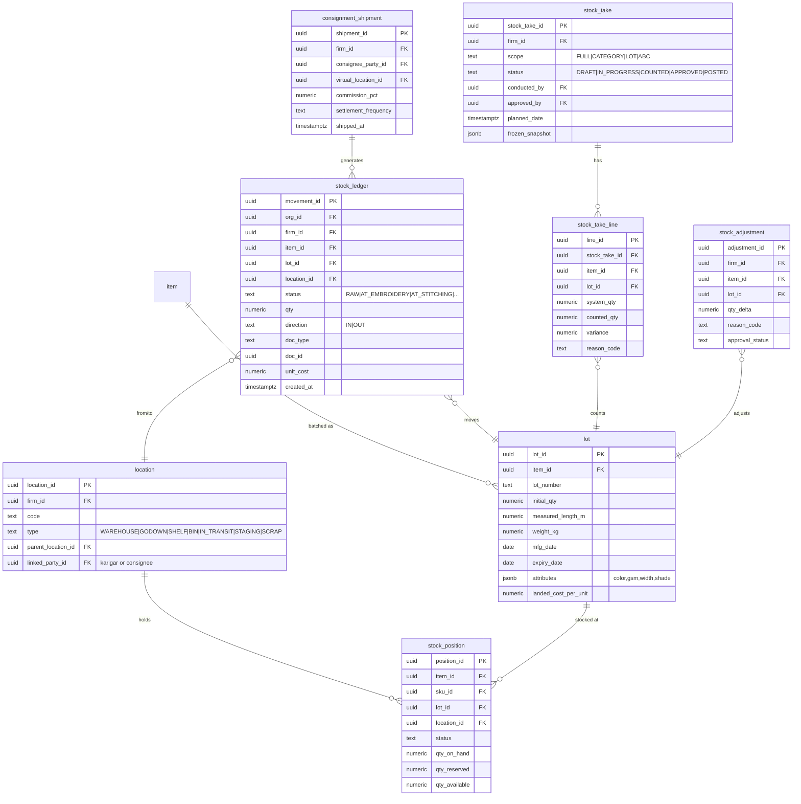
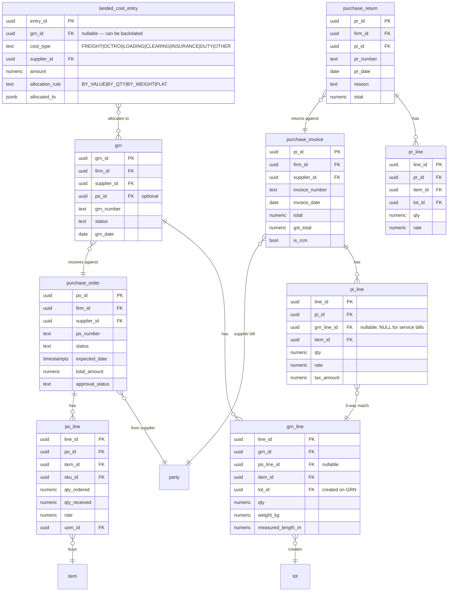
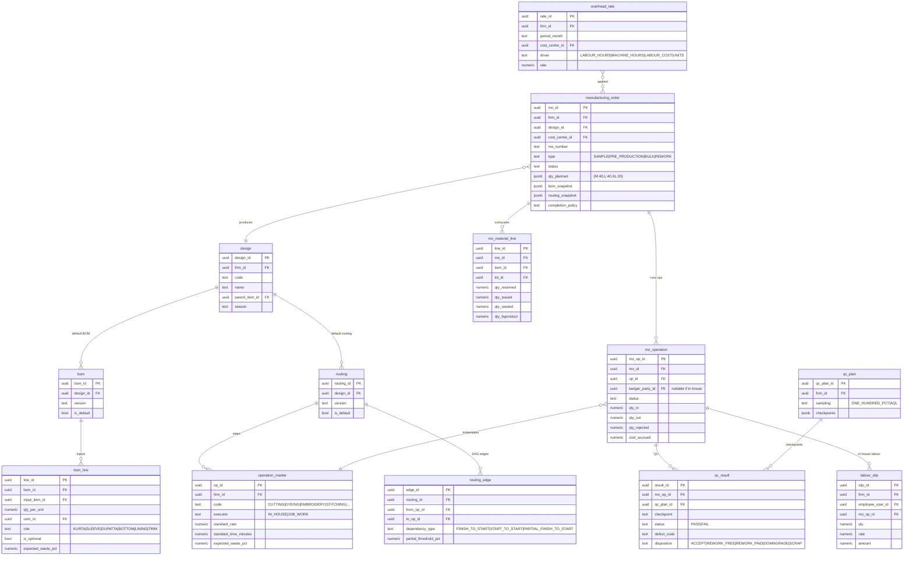
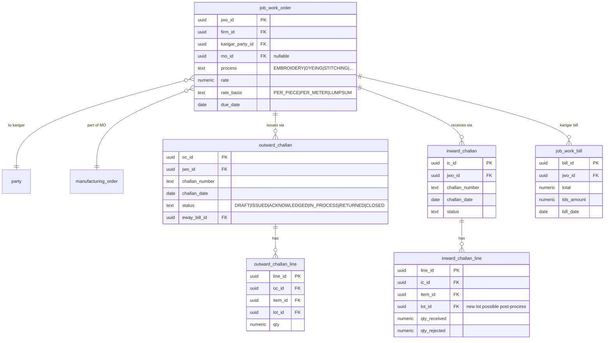
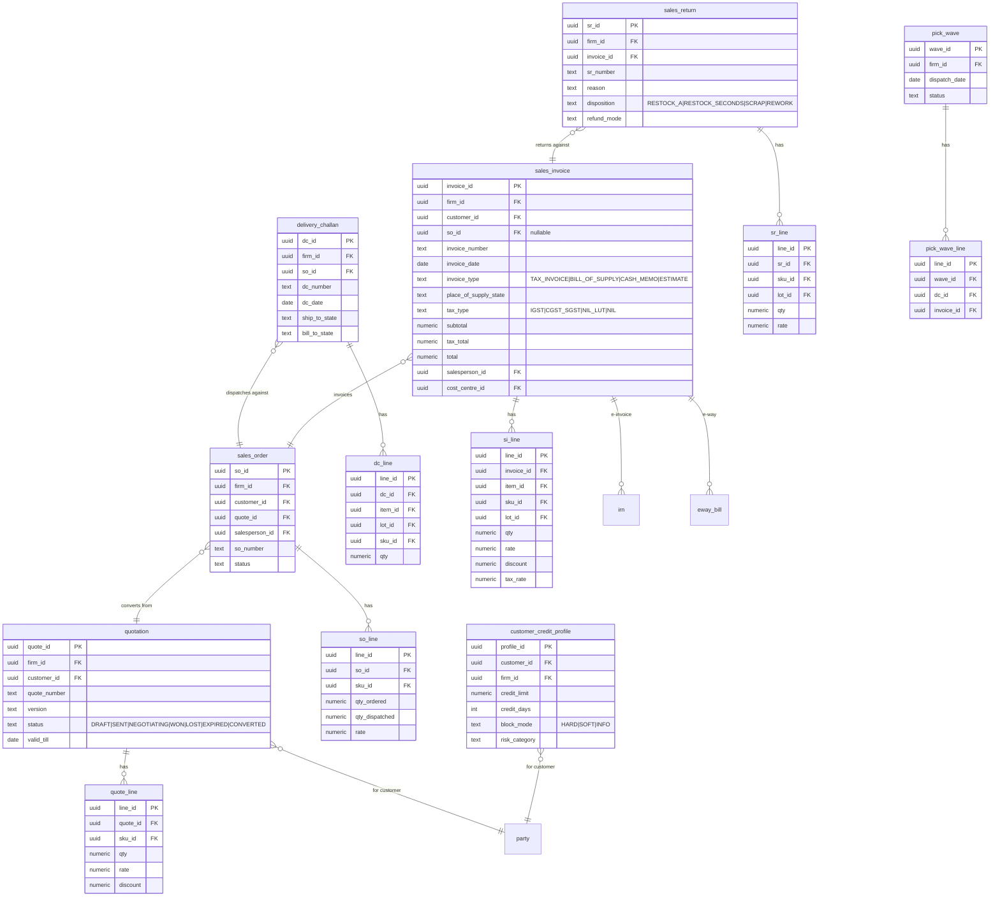
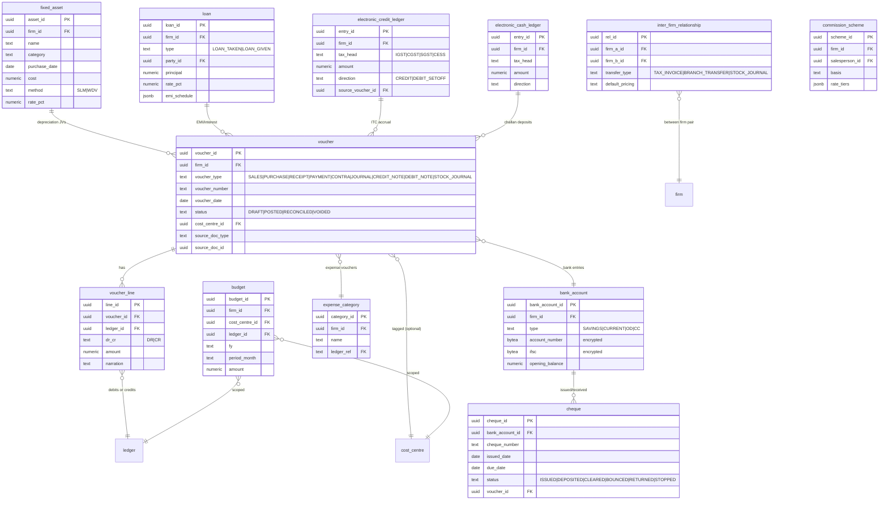

# Fabric & Ladies-Suit ERP — Entity-Relationship Diagram

**Companion to:** `ddl.sql` (93 tables, Postgres 16, RLS-enabled).
**Paired with:** `architecture.md` §4–§5 (tenancy + domain model), §17 (concrete entity fixes).

Mermaid renders ER diagrams gracefully up to ~30 entities per chart before readability suffers. Rather than one huge diagram, this document presents:

1. A **high-level context diagram** showing module-to-module relationships.
2. **Nine per-module ER diagrams** (identity, masters, stock, procurement, manufacturing, job work, sales, accounting, compliance + platform).
3. **Design notes** at the end covering RLS, partitioning, and cross-module keys.

All foreign keys in the DDL use `ON DELETE RESTRICT` by default. Tenant columns (`org_id`, `firm_id`) are implicit on every tenant-scoped table (shown only where relevant to readability).

---

## 1. High-level module map

---

## 2. Identity, users, permissions

---

## 3. Masters — parties, items, ledgers, price lists

---

## 4. Inventory — lots, locations, stock ledger

---

## 5. Procurement

---

## 6. Manufacturing — designs, BOMs, MOs, routing, QC

---

## 7. Job Work

---

## 8. Sales

---

## 9. Accounting

---

## 10. Compliance & platform

```mermaid
erDiagram
    sales_invoice ||--o{ irn : "e-invoice IRN"
    sales_invoice ||--o{ eway_bill : "e-way"
    firm ||--o{ gstr_filing : "periodic filings"
    job_work_order ||--o{ itc04_entry : "ITC-04 rows"
    voucher ||--o{ tds_entry : "TDS deducted"
    organization ||--o{ outbound_message : "sends"
    organization ||--o{ scheduled_report : "subscriptions"
    organization ||--o{ feature_flag : "toggles"
    app_user ||--o{ notification : "receives"
    organization ||--o{ subscription : "billing"
    subscription }o--|| plan : "on plan"

    irn {
        uuid irn_id PK
        uuid invoice_id FK
        text irn_hash
        text qr_payload
        timestamptz fetched_at
        text status "GENERATED|CANCELLED"
    }
    eway_bill {
        uuid eway_id PK
        uuid doc_id FK "invoice or challan"
        text doc_type
        text eway_number
        timestamptz valid_till
    }
    gstr_filing {
        uuid filing_id PK
        uuid firm_id FK
        text return_type "GSTR1|GSTR3B|GSTR9|ITC04"
        text period
        text status "DRAFT|PREPARED|FILED|ACKNOWLEDGED"
        jsonb json_payload
    }
    itc04_entry {
        uuid entry_id PK
        uuid jwo_id FK
        text quarter
        numeric qty_sent
        numeric qty_received
    }
    tds_entry {
        uuid tds_id PK
        uuid voucher_id FK
        text section "194C|194J|194I|194H"
        numeric amount
        text tan
    }
    outbound_message {
        uuid message_id PK
        uuid org_id FK
        text channel "WHATSAPP|SMS|EMAIL"
        text template
        text status "QUEUED|SENT|DELIVERED|FAILED"
        int retry_count
    }
    scheduled_report {
        uuid scheduled_id PK
        uuid user_id FK
        text report_type
        text cadence
        text channel
        timestamptz next_run_at
    }
    feature_flag {
        uuid flag_id PK
        text key
        bool default_value
        jsonb org_overrides
    }
    notification {
        uuid notification_id PK
        uuid user_id FK
        text type
        jsonb payload
        timestamptz read_at
    }
    plan {
        uuid plan_id PK
        text name
        jsonb limits "firms,users,invoices_per_month,storage_gb"
        numeric monthly_price
    }
    subscription {
        uuid subscription_id PK
        uuid org_id FK
        uuid plan_id FK
        text status "TRIAL|ACTIVE|DUNNING|SUSPENDED|CANCELLED"
        date current_period_end
    }
```

---

## 11. Design notes

### Row-level security
Every tenant-scoped table carries `org_id UUID NOT NULL` with a Postgres RLS policy `USING (org_id = current_setting('app.current_org_id')::uuid)`. The session sets `app.current_org_id` and `app.current_firm_id` on every connection via `SET LOCAL`. Firm-scoped tables additionally carry `firm_id`. This gives us defence in depth — even a missing WHERE clause in application code cannot leak data across tenants.

### Encryption (envelope)
PII columns typed as `BYTEA`: GSTIN, PAN, bank account, IFSC, Aadhaar-last-4. Plaintext is never stored. Each org has its own DEK wrapped by an org-specific KMS CMK; request-scoped DEK caching (per §17.10.4) keeps KMS calls at O(1) per request per tenant.

### Partitioning hints
- `stock_ledger` — partition by `(org_id, year_of_created_at)`; large customers stay isolated, queries stay fast.
- `audit_log` — partition by `(org_id, month_of_created_at)`; supports hash-chain validation per tenant per month.
- `voucher_line` — partition by `(org_id, fy)`; natural aggregation axis for P&L and TB.
- `outbound_message` — partition by month; old records archived.

### Cross-module reference pattern
Voucher references its source subledger document via `(source_doc_type, source_doc_id)` — intentionally polymorphic rather than adding N nullable FKs. Enforced by application-layer invariant plus a CHECK that `source_doc_type ∈ known_types`.

### UUIDs vs bigserial
UUID everywhere. Tradeoffs: slightly bigger indexes, marginal write amplification. Gains: safe offline generation (critical for Android-first offline workflow per §5.6 / §17.8), no sequence contention across partitions, no information leak via ID counts.

### Soft deletes
`deleted_at TIMESTAMPTZ` nullable on every table. Statute-bound data (6-year GST retention) cannot be hard-deleted until retention lapses; soft-delete filters via RLS and application layer. Hard-delete reserved for the DPDP erasure pathway (§17.7.1) — PII tokenized, transactional rows retained.

### Approvals & workflow states
No separate `approval` table — each entity carries `approval_status` and `approved_by` columns. Approval chain rules live in the application's RBAC layer (§17 / §4 RBAC). This keeps audit trails local to the entity and avoids a crowded join for most queries.

### Indexes
Every table has: `(org_id)` index (supports RLS plan), `(firm_id, created_at DESC)` for recent-activity queries, business-key unique indexes `(firm_id, code)` on masters. Specific hot paths (e.g. `stock_position (item_id, lot_id, location_id)`) carry their own composite index; these are called out in the DDL comments.

### Missing tables by intent (not oversight)
- **Attachments** — Phase 2: `attachment(entity_type, entity_id, s3_key, content_type)` single table, not per-module.
- **Config/Settings** — handled via `feature_flag` + a per-firm `settings` JSONB column (TBD where pressure arises).
- **Reports/Materialized-views** — declared at migration time, not as master data.

---

## 12. Next steps

1. Generate TypeScript types from DDL (via Prisma introspect or `pg-to-ts`) for frontend contracts.
2. Write seed scripts: pre-seed COA groups, default roles, standard permissions, HSN codes, UOMs, default operation masters per textile industry.
3. Schema migration baseline: wrap DDL into Alembic initial migration.
4. Test data factory for integration tests — per-test org with clean tenant scope.
5. Cross-check against OpenAPI spec (`specs/api-phase1.yaml`) — every endpoint must map to table(s) with correct RLS-scoped access.
