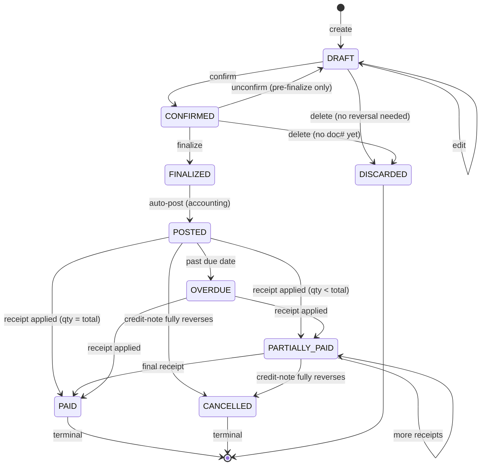

# Invoice Lifecycle & Full Accounting Flow

**Status:** Design spec, Phase 1 blocker
**Companion to:** `architecture.md` §5.7, §5.8, §17.4, §17.1 · `schema/ddl.sql` · `specs/api-phase1.yaml`
**Answers:** "Is invoice creation and management with full account support missing?"

---

## 0. Verification — what's already covered vs what this doc adds

| Concern | Status | Location |
|---|---|---|
| Invoice data model | ✓ Covered | `ddl.sql` → `sales_invoice`, `si_line`, `purchase_invoice`, `pi_line` |
| Sales flow narrative | ✓ Covered | `architecture.md` §5.7 |
| Accounting auto-postings | ✓ Covered | `architecture.md` §5.8.16 table |
| API endpoints | ✓ Covered | `api-phase1.yaml` `/invoices*`, `/vouchers*` |
| Basic entry screen | ✓ Covered | `screens-phase1.md` Sales section |
| **Invoice state machine** | **✗ Missing — added here §2** | — |
| **Pre-finalization checklist** | **✗ Missing — added here §4** | — |
| **Numbering policy (gapless, FY, series)** | ✗ Partial — consolidated here §3 | — |
| **Amendment & cancellation policy** | ✗ Partial — consolidated here §7 | — |
| **Payment allocation algorithm** | **✗ Missing — added here §6** | — |
| **Finalization atomicity (IRN, e-way, post, notify)** | ✗ Partial — consolidated here §5 | — |
| **Print / share / resend workflow** | **✗ Missing — added here §9** | — |
| **Worked example: GST + non-GST + partial payments** | **✗ Missing — added here §10** | — |

**Conclusion:** invoice creation/management is **not missing** — the data model, API, screens, and postings table all exist. What was missing was the *glue spec*: state machine, validation rules, and workflows that tie them together. This document is that glue.

---

## 1. Scope

**In scope of this spec:**
- Sales Invoice (Tax Invoice, Bill of Supply, Cash Memo, Estimate)
- Purchase Invoice
- Credit Note (sales return)
- Debit Note (purchase return)
- Receipt voucher (against invoice)
- Payment voucher (against bill)
- The accounting postings that hang off each

**Out of scope (covered elsewhere):**
- GST filing (GSTR-1/3B) — `architecture.md` §5.8.8
- Reports — `architecture.md` §5.8.13
- Recurring / subscription invoices — Phase 3

---

## 2. Invoice state machine



**State rules:**

| State | Can edit? | Doc # assigned? | Stock committed? | Accounting posted? | GST reported? |
|---|---|---|---|---|---|
| DRAFT | Yes (any field) | No | No | No | No |
| CONFIRMED | Yes (limited) | No | Soft-reserved | No | No |
| FINALIZED | No (credit note only) | Yes (gapless) | Hard-issued | In-flight | Queued |
| POSTED | No | Yes | Hard-issued | Posted | Yes |
| PARTIALLY_PAID | No | Yes | Hard-issued | Posted | Yes |
| PAID | No | Yes | Hard-issued | Posted | Yes |
| OVERDUE | No | Yes | Hard-issued | Posted | Yes |
| CANCELLED | No | Yes (retained) | Reversed via CN | Reversed via CN | Adjusted |
| DISCARDED | — | — | — | — | — |

**FINALIZED → POSTED is guaranteed to complete** (within a transaction boundary; see §5). Clients only ever see POSTED or later externally; FINALIZED is a ~sub-second intermediate state.

---

## 3. Numbering policy

**Rule:** Gapless, per-firm, per-series, per-financial-year.

```
sales_invoice.invoice_number = <series_prefix>/<fy_short>/<padded_seq>

Examples
  Firm A GST series:  TI/25-26/000847
  Firm A non-GST:     BOS/25-26/000312
  Firm A RCM self:    RCM/25-26/000004
  Firm B retail:      CM/25-26/001204
  Credit notes:       CN/25-26/000012  (separate sequence)
```

- **Series is a master table** `document_series(firm_id, doc_type, prefix, fy, last_seq)`.
- **Finalization allocates the sequence atomically** via `SELECT ... FOR UPDATE` on the series row.
- **Gapless** → if finalize fails mid-flight, sequence is rolled back (transaction boundary).
- **FY roll-over** auto-creates a new series row at `FY-start 00:00 IST`; old series is frozen.
- **Hole fills forbidden.** Cancelled invoice numbers are *retained* (marked CANCELLED), never reused. A credit note reverses the effect; the number itself stays.
- **Client can't set the number.** Server assigns on FINALIZE transition. Prior states have `invoice_number IS NULL`.

---

## 4. Pre-finalization validation checklist

Every CONFIRMED → FINALIZED transition runs this list. **Any failure keeps the invoice CONFIRMED with a structured error response so the UI can highlight the failing row/field.**

| Check | Rule | On fail |
|---|---|---|
| **Customer active** | `party.status = ACTIVE`, not BLOCKED | HARD block |
| **Credit limit** | `outstanding + this_invoice ≤ credit_limit` **unless** `party.credit_profile.block_mode = SOFT/INFO` or `sales.credit.override` permission held | HARD / WARN per mode |
| **Aged-overdue** | No invoice > `credit_days` days overdue (unless overridden) | HARD (if HARD mode) |
| **Stock availability** | For every line, ATP at dispatch location ≥ line qty (or `allow_negative_stock = WITH_OVERRIDE` + override granted) | BLOCK or require override |
| **Place of supply determined** | Per §17.4.5 engine; `tax_type ∈ {IGST, CGST+SGST, NIL_LUT, NIL}` resolves cleanly | BLOCK |
| **Tax calculation sane** | Line subtotals and tax roll up to header totals within ₹1 rounding; round-off line auto-added if needed | BLOCK |
| **Required fields** | Customer GSTIN present if `invoice_type = TAX_INVOICE` and `customer.tax_status = REGULAR` | BLOCK |
| **E-invoice applicability** | If firm turnover ≥ threshold, IRN must be fetchable (online required per §17.8.3) | BLOCK offline |
| **E-way applicability** | Value ≥ ₹50k and (interstate OR distance > 50km) → e-way auto-generated | BLOCK if can't fetch |
| **Period open** | Invoice date falls in an unlocked accounting period | BLOCK |
| **Duplicate detection** | No pending/finalized invoice with same (customer, date, exact totals) in last 24h | WARN |
| **Salesperson assigned** | `salesperson_id` set (for attribution / commission) | WARN |
| **Rate/price movement** | Line rate deviates > 10% from party's last rate for same SKU | WARN |
| **Margin sanity** | Margin % ≥ firm's configured minimum (if enforced) | WARN (or BLOCK) |

**UI**: the "Finalize" button runs the checklist client-side for instant feedback, then server re-runs authoritatively. Overridable warnings are surfaced in a modal ("3 warnings — proceed anyway?") with justification text captured and audit-logged.

---

## 5. Finalization flow (atomic guarantees)

`POST /v1/invoices/{id}/finalize`

The server runs this as one transaction for DB state, with compensating actions for external side effects:

```
BEGIN TX
  1. Re-run §4 checklist server-side
  2. Allocate invoice_number from document_series (FOR UPDATE)
  3. Allocate e-way series number (if applicable)
  4. UPDATE sales_invoice SET status='FINALIZED', invoice_number=..., finalized_at=NOW()
  5. INSERT stock_ledger rows (one per line): Main → In-Transit, status OUT
  6. UPDATE stock_position: decrement available, increment in_transit
  7. INSERT voucher (type='SALES', doc_ref=invoice_id)
  8. INSERT voucher_line rows (Dr Customer, Cr Sales, Cr GST Output)
  9. INSERT cost_centre tags where applicable
 10. UPDATE customer ledger balance (materialized)
 11. INSERT audit_log row
 12. UPDATE sales_invoice SET status='POSTED'
COMMIT
```

Then, outside the TX, enqueue async Celery tasks for:
- **IRN fetch** (e-invoice) — non-blocking; on success, stamp IRN on invoice, mark `irn_status=GENERATED`. On failure after N retries: flag + alert; invoice still POSTED.
- **E-way bill** — same pattern, tighter SLA (24h window).
- **WhatsApp send** (if party opted in and salesperson ticked "Send").
- **Notification fan-out** (dashboard, scheduled reports).

**Failure handling:**
- If any step 1–11 fails → TX rolls back; invoice stays CONFIRMED; user sees the exact reason.
- If step 12 fails → same.
- If IRN/e-way fails post-COMMIT → invoice stays POSTED but flagged `irn_pending`; retry worker runs every 30 sec for first 10 min, then exponential. If still pending after 15 min and invoice is about to ship → UX blocks dispatch with "IRN pending" banner.
- If WhatsApp fails → retry 3×; no impact to invoice state.

**Concurrency:** `FOR UPDATE` on series row makes sequence allocation serializable. Other rows lock in normal FK order to avoid deadlocks (customer → stock → voucher).

---

## 6. Payment allocation algorithm

When a receipt comes in, how does it get applied against open invoices?

**Two modes, firm-configurable:**

### 6.1 Automatic (FIFO on due date)

```
Inputs: customer_id, firm_id, amount, receipt_date
Steps:
  1. Fetch open invoices for (customer_id, firm_id)
     where status IN {POSTED, PARTIALLY_PAID, OVERDUE}
     order by due_date ASC, invoice_number ASC
  2. For each invoice:
       outstanding = invoice.total - invoice.paid_so_far
       apply = min(remaining_amount, outstanding)
       create allocation(receipt_id, invoice_id, amount=apply)
       invoice.paid_so_far += apply
       remaining_amount -= apply
       if invoice.paid_so_far == invoice.total:
         invoice.status = 'PAID'
       else:
         invoice.status = 'PARTIALLY_PAID'
       if remaining_amount == 0: break
  3. If remaining_amount > 0:
       create unadjusted_advance(party=customer, amount=remaining_amount)
       # sits on customer ledger as credit, auto-applies to next invoice
```

### 6.2 Manual (user picks)

- UI lists all open invoices with outstanding; user ticks which to apply and enters amount per line.
- Sum must equal receipt amount (unadjusted → advance).
- Useful when customer explicitly says "this payment is for invoice #847".

### 6.3 TDS adjustment

If the customer has deducted TDS (`invoice.total − receipt = TDS`), the allocation is split:
- Real cash part → Bank (or Cash)
- TDS part → `TDS Receivable` asset ledger (reconciles with Form 26AS later)

### 6.4 Cheque bounce reversal

Covered in §17.1.10 — reverses the specific allocations created by the bounced receipt; invoice goes back to its prior state (PARTIALLY_PAID → POSTED, or PAID → PARTIALLY_PAID).

---

## 7. Amendment & cancellation policy

**GST rule (reflected in our system):** a finalized tax invoice cannot be edited. Corrections go through Credit Note (reduce) or supplementary invoice (increase).

| Scenario | Mechanism |
|---|---|
| Typo in customer address on DRAFT | Edit the invoice, re-confirm, re-finalize |
| Typo on FINALIZED invoice | Issue Credit Note for full reversal + new correct Invoice (linked via `revises_invoice_id`) |
| Wrong qty (customer returned some) | Credit Note for the returned qty (§17.4.7) |
| Rate too high, post-sale discount | Credit Note for discount amount (GST adjusted) |
| Complete cancellation, within 24h (GST firm, e-invoiced) | Invoice moves to CANCELLED; **IRN must be cancelled on IRP within 24h**; otherwise credit note route |
| Complete cancellation, after 24h | Credit Note reversing the entire amount → invoice → CANCELLED |
| Non-GST firm, any timeframe | Direct cancellation → invoice → CANCELLED with reason captured |

**Cancellation always requires:**
- Permission `sales.invoice.cancel`
- Reason (enum + free text)
- Approver if invoice value > firm threshold (e.g. ₹25k)
- Audit-log entry
- Reversal of stock (add back), accounting (contra voucher), and any receipts (become advances)

---

## 8. Purchase Invoice lifecycle (symmetric)

Mirrors sales but supplier-side:

```
DRAFT → CONFIRMED → MATCHING → POSTED → PARTIALLY_PAID | PAID | OVERDUE → [PAID]
                           └─→ ON_HOLD (3-way-match mismatch)
                           └─→ DISPUTED (supplier dispute)
```

- **MATCHING** state runs the 3-way match (§17.5.1): PO vs GRN vs supplier's invoice.
- **ON_HOLD** if mismatch > tolerance; routed to approver for override/reject.
- Payment to supplier = Payment Voucher against the PI; allocation FIFO on supplier due-date.
- Debit Note (§5.3 purchase returns) reverses per same rules as credit note.

---

## 9. Print, share, resend

Every finalized invoice lives in the document repository:

| Action | Behaviour |
|---|---|
| **Print** | Renders PDF using firm's default template (user can override). Sizes: A4, A5, thermal 80mm. Multi-language per party preference. |
| **Download** | Signed S3 URL, 15-min validity, audit-logged. |
| **Email** | Uses firm's SMTP / SendGrid; template-driven; CC to salesperson, BCC to accounts. |
| **WhatsApp** | Meta Cloud API; approved template with PDF attachment + UPI payment link (QR). Delivery receipt tracked. |
| **SMS** | Fallback for parties without WhatsApp. Short-URL to PDF. |
| **Resend** | Pick any prior shared instance or send fresh; counter visible on invoice ("Sent 3 times — last Apr 20"). |
| **Regenerate IRN QR** | After IRN fetched, QR is stamped on future prints automatically. |
| **Attachment upload** | User can attach e.g. packing list image, courier slip (S3, encrypted). |

**Print history** table: `invoice_share(invoice_id, channel, recipient, sent_at, status)` — supports audit + "did we send the reminder?" queries.

---

## 10. Worked example — full accounting walkthrough

### 10.1 Sale — GST, partial payment, TDS

Firm A (Maharashtra, GST). Customer C1 (Karnataka, GST). Invoice ₹1,00,000 + 5% IGST = ₹1,05,000. Customer pays ₹94,500 by NEFT, deducts ₹500 TDS (not applicable here — illustrative).

Finalize:
```
Voucher type = SALES, voucher_number = JV-AUTO-001
  Dr  Customer C1 ledger        1,05,000
  Cr  Sales — Domestic GST     1,00,000
  Cr  IGST Output Payable         5,000
Stock journal:
  Dr  COGS                        80,000   (FIFO cost)
  Cr  Stock (Lot L-17)            80,000
Electronic Liability Ledger: +5,000 IGST
```

Receipt (customer pays ₹1,04,500 — deducting ₹500 TDS):
```
Voucher type = RECEIPT
  Dr  Bank                      1,04,500
  Dr  TDS Receivable                 500
  Cr  Customer C1 ledger        1,05,000
invoice.paid_so_far = 1,05,000 → status = PAID
```

### 10.2 Sale — non-GST firm, cash memo, partial payment over time

Firm B (non-GST). Customer C2 (retail, unregistered). Invoice ₹15,000. Customer pays ₹5,000 cash now, balance on credit.

Finalize:
```
Voucher type = SALES
  Dr  Customer C2 ledger          15,000
  Cr  Sales — Retail              15,000
Stock journal:
  Dr  COGS                         8,500
  Cr  Stock                        8,500
```

Receipt (partial):
```
Voucher type = RECEIPT
  Dr  Cash                         5,000
  Cr  Customer C2 ledger           5,000
invoice.paid_so_far = 5,000 → status = PARTIALLY_PAID
```

After 35 days, invoice moves to OVERDUE. Credit profile ages it into 31-60 bucket. Auto-reminder template sends WhatsApp. Final receipt cleans it up.

### 10.3 Sale → partial return → partial refund

Invoice ₹50,000 + 5% = ₹52,500 for 50 suits. Customer receives goods, returns 10 suits defective. Credit Note issued.

Credit Note:
```
Voucher type = CREDIT_NOTE
  Dr  Sales — Domestic GST        10,000
  Dr  IGST Output Payable            500  (reversal)
  Cr  Customer C1 ledger          10,500
Stock journal (disposition = RESTOCK_SECONDS):
  Dr  Stock (A-402-SECONDS)        7,000   (reduced cost)
  Dr  Inventory Loss               1,000   (A-grade cost − seconds cost)
  Cr  Stock (A-402 original)       8,000
Electronic Liability Ledger: −500 IGST (same period)
```

Customer's outstanding drops by ₹10,500. No cash refund (adjusted on ledger).

### 10.4 Purchase with 3-way match mismatch → hold → approve

Supplier S1 bills ₹62,000 (GST 5% extra). PO was ₹60,000. Variance = 3.3% > 2% tolerance.

```
PI enters MATCHING state → detects variance → status = ON_HOLD
Approver role (Procurement Head) gets a task.
Approver accepts with reason "market rate moved":
  PI → POSTED:
    Dr  Stock                      62,000
    Dr  GST Input Credit            3,100
    Cr  Supplier S1 ledger         65,100
  ECL (Electronic Credit Ledger): +3,100 CGST/SGST
```

---

## 11. API surface (cross-reference)

Already in `api-phase1.yaml`; summarized here for completeness.

| Verb | Endpoint | Purpose |
|---|---|---|
| POST | `/v1/invoices` | Create DRAFT |
| GET | `/v1/invoices` | List with filters (status, party, date range, cursor) |
| GET | `/v1/invoices/{id}` | Detail with lines + postings + allocations |
| PATCH | `/v1/invoices/{id}` | Edit (only DRAFT/CONFIRMED) |
| POST | `/v1/invoices/{id}/confirm` | DRAFT → CONFIRMED |
| POST | `/v1/invoices/{id}/finalize` | CONFIRMED → FINALIZED → POSTED (atomic, returns invoice# + IRN status) |
| POST | `/v1/invoices/{id}/cancel` | POSTED → CANCELLED (with reason) |
| POST | `/v1/invoices/{id}/send` | WhatsApp/SMS/Email dispatch |
| POST | `/v1/invoices/{id}/print` | Returns signed S3 URL to PDF |
| GET | `/v1/invoices/{id}/share-history` | Delivery log |
| POST | `/v1/sales-returns` | Create Credit Note against invoice |
| POST | `/v1/vouchers` (type=RECEIPT) | Create receipt with allocations |
| POST | `/v1/vouchers/{id}/post` | Post a manual voucher |
| GET | `/v1/reports/ageing?party_id=...` | Party-wise ageing |

Additional for purchase:
- `/v1/purchase-invoices` (full CRUD)
- `/v1/purchase-invoices/{id}/match` — trigger 3-way match
- `/v1/purchase-invoices/{id}/release-hold` — approver action
- `/v1/purchase-returns` — Debit Note

---

## 12. UI flow — Vyapar-speed invoice entry

**Primary screen: SCR-SALES-005 Invoice Entry (Quick Mode)**

Keyboard-first, single-screen entry:

```
┌───────────────────────────────────────────────────────────────┐
│ [Firm▼] [Series▼]    DATE: 23-Apr-2026     [DRAFT badge]      │
│                                                                │
│ Customer: [Start typing...]   ⓘ Credit ₹32,000 / ₹50,000      │
│                                                                │
│ ┌──────────────────────────────────────────────────────────┐  │
│ │ # │ Item            │ Qty │ UOM │  Rate │ Disc │ GST│ Amt│  │
│ │ 1 │ Banarasi A-402  │  50 │ pc  │ 1,800 │  0%  │  5%│95k │  │
│ │ 2 │ Dupatta D-11    │  50 │ pc  │   450 │  0%  │  5%│24k │  │
│ │ + add item (scan barcode or type)                         │  │
│ └──────────────────────────────────────────────────────────┘  │
│                                                                │
│ Subtotal: ₹1,12,500     GST (5%): ₹5,625     Total: ₹1,18,125 │
│ Round-off: ₹0.00        Payment now: [Cash ▼] [₹______]        │
│                                                                │
│ Notes: [__________________]                                    │
│                                                                │
│ [Save Draft] [Save & New (N)] [Save & Print (P)] [Save & WhatsApp (W)] │
└───────────────────────────────────────────────────────────────┘
```

**Shortcuts:**
- `N` → Save and start new invoice
- `Ctrl+S` → Save draft
- `Ctrl+Enter` → Save and finalize
- `Alt+Down` in item field → price list suggestion
- `F2` on line → edit line detail modal (batch/lot pick, per-line discount, custom HSN)
- `Esc` → cancel with confirm

**Detailed mode** (SCR-SALES-005b) — same data, extra tabs: Shipping address, Additional charges (transport/packing), Terms & conditions, Custom fields, Attachments. One-click toggle from quick mode.

---

## 13. Edge cases (explicitly handled)

1. **Invoice with zero qty** (service-only, e.g. pure labour) — allowed; stock journal skipped; `si_line.qty = 0, si_line.rate = <labour rate>`.
2. **Negative line** (discount as a line) — not preferred; use line-level `discount_pct` or `discount_amount`. If firm insists on negative-line style, we support it but validate `total ≥ 0`.
3. **Invoice with mixed tax rates** — allowed (two items at 5%, one at 12%). Place of supply shared; each line carries own rate.
4. **Invoice crossing FY midnight** — invoice_date freezes when FINALIZED; series is FY of invoice_date not finalize_timestamp. Edge: drafts created 31-Mar can finalize 1-Apr, and will land in NEW FY series if invoice_date is updated.
5. **Rounding** — line totals rounded to 2 decimals; header total rounded to nearest rupee; difference booked to `Round-off` ledger. Configurable (rupee vs paisa).
6. **Customer with GSTIN but non-GST firm** — customer GSTIN captured (master), not printed on Bill of Supply.
7. **Firm turnover crosses GST threshold mid-year** — firm tax_regime switch is a distinct process (migration); invoices before switch remain non-GST, after the switch are GST.
8. **Salesperson transferred mid-invoice-cycle** — `salesperson_id` on invoice is the one at time of FINALIZE; handover is tracked separately on party master.
9. **Same-day multiple invoices to same customer** — allowed; duplicate-detection is WARN only.
10. **Invoice entered via Android offline** — stays DRAFT until sync; server re-validates and assigns number on reconnect (§17.8.2).

---

## 14. Integration points

- **Inventory** → Stock journal on FINALIZE / CREDIT_NOTE / CANCEL; ATP consumption on CONFIRM (soft reservation).
- **Accounting** → Voucher auto-created; voucher_line debits/credits per §5.8.16.
- **Compliance** → IRN + e-way triggered on FINALIZE; GSTR-1 pulls monthly.
- **Manufacturing** → Optional `linked_mo_id` on invoice line tells you which MO produced the stock that just sold (useful for MO P&L).
- **Credit control** → Pre-finalize checklist (§4); post-finalize aging buckets.
- **Commission** → `salesperson_id` feeds commission engine.
- **Cost centre** → `cost_centre_id` on invoice cascades to lines & voucher lines.
- **Notifications** → On POSTED, fan-out: owner dashboard tile refresh, scheduled reports, WhatsApp outbox.
- **Audit** → every state transition logs before/after hashes.

---

## 15. What Phase 1 must deliver (final checklist)

- [x] `sales_invoice` + `si_line` tables with status column (DDL has it)
- [x] `voucher` + `voucher_line` with type enum (DDL has it)
- [ ] `document_series` table for gapless numbering *(add — minor DDL patch)*
- [ ] `invoice_share` table for print/send history *(add)*
- [x] API endpoints (skeleton exists)
- [ ] State machine enforcement middleware (invoicing state guard)
- [ ] Pre-finalization checklist runner (§4) — reusable service
- [ ] Finalization transaction (§5) — idempotent, tested
- [ ] Payment allocation engine (§6) — both auto + manual modes
- [ ] Credit Note flow end-to-end
- [ ] Invoice Quick Entry screen wired to all of the above
- [ ] 25+ integration tests covering §10 walkthrough scenarios
- [ ] Load test: 10 concurrent users finalizing invoices → no sequence gaps

---

## 16. DDL deltas required

Two small additions:

```sql
-- Gapless document numbering per firm × doc_type × FY
CREATE TABLE document_series (
    series_id     UUID PRIMARY KEY DEFAULT gen_random_uuid(),
    org_id        UUID NOT NULL,
    firm_id       UUID NOT NULL REFERENCES firm(firm_id),
    doc_type      VARCHAR(50) NOT NULL,
    prefix        VARCHAR(20) NOT NULL,
    fy            VARCHAR(7) NOT NULL,           -- '25-26'
    last_seq      BIGINT NOT NULL DEFAULT 0,
    is_active     BOOLEAN NOT NULL DEFAULT TRUE,
    created_at    TIMESTAMPTZ NOT NULL DEFAULT NOW(),
    UNIQUE (firm_id, doc_type, fy)
);
ALTER TABLE document_series ENABLE ROW LEVEL SECURITY;
CREATE POLICY document_series_rls ON document_series
  USING (org_id = current_setting('app.current_org_id')::uuid);

-- Share/delivery history per invoice (generalize: any doc)
CREATE TABLE invoice_share (
    share_id      UUID PRIMARY KEY DEFAULT gen_random_uuid(),
    org_id        UUID NOT NULL,
    firm_id       UUID NOT NULL,
    invoice_id    UUID NOT NULL REFERENCES sales_invoice(invoice_id) ON DELETE CASCADE,
    channel       VARCHAR(20) NOT NULL,         -- WHATSAPP|EMAIL|SMS|PRINT|DOWNLOAD
    recipient     TEXT,
    sent_at       TIMESTAMPTZ NOT NULL DEFAULT NOW(),
    status        VARCHAR(20) NOT NULL,         -- QUEUED|SENT|DELIVERED|READ|FAILED
    delivery_receipt JSONB,
    sent_by       UUID                          -- app_user
);
CREATE INDEX idx_invoice_share_invoice ON invoice_share(invoice_id, sent_at DESC);
ALTER TABLE invoice_share ENABLE ROW LEVEL SECURITY;
CREATE POLICY invoice_share_rls ON invoice_share
  USING (org_id = current_setting('app.current_org_id')::uuid);
```

Also extend `sales_invoice` with a few columns (if not already present):
```sql
ALTER TABLE sales_invoice
  ADD COLUMN IF NOT EXISTS status VARCHAR(20) NOT NULL DEFAULT 'DRAFT',
  ADD COLUMN IF NOT EXISTS finalized_at TIMESTAMPTZ,
  ADD COLUMN IF NOT EXISTS paid_amount NUMERIC(18,2) NOT NULL DEFAULT 0,
  ADD COLUMN IF NOT EXISTS due_date DATE,
  ADD COLUMN IF NOT EXISTS irn_status VARCHAR(20),
  ADD COLUMN IF NOT EXISTS eway_status VARCHAR(20),
  ADD COLUMN IF NOT EXISTS revises_invoice_id UUID REFERENCES sales_invoice(invoice_id),
  ADD COLUMN IF NOT EXISTS linked_mo_id UUID,   -- manufacturing link
  ADD COLUMN IF NOT EXISTS cost_centre_id UUID;
```

---

**Bottom line:** invoice creation + management + full accounting is **not missing** — it's now *specified end-to-end* with state machine, atomicity rules, payment algorithm, and walkthrough examples that test-engineers can transcribe directly into pytest.
