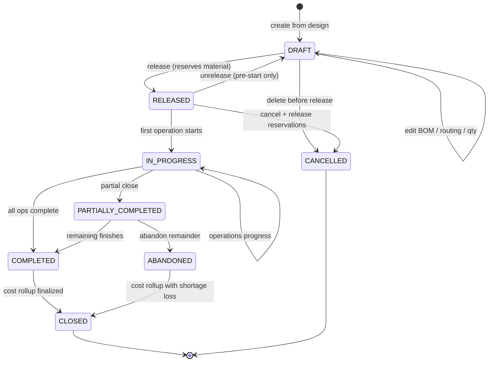
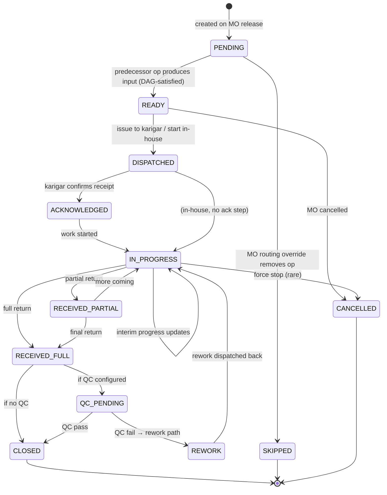
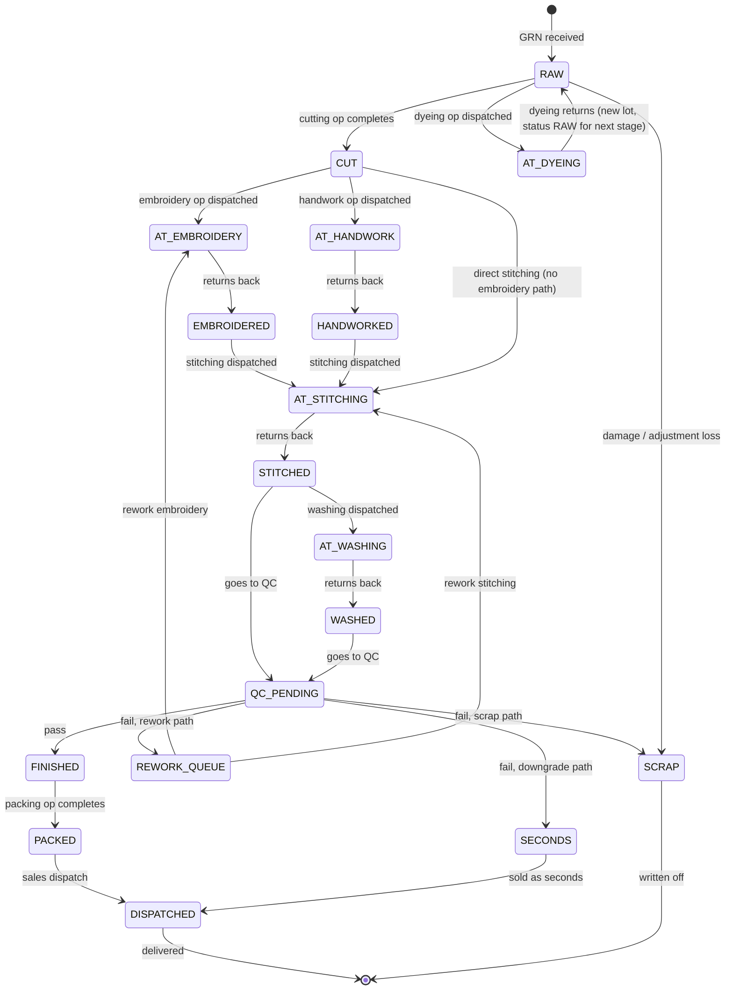

# Manufacturing Pipeline — State Management & Workflow

**Status:** Design spec, Phase 3 blocker (but hook points must exist in Phase 1 DDL)
**Companion to:** `architecture.md` §5.6, §17.3 · `schema/ddl.sql` manufacturing section · `schema/erd.md` §6
**Answers:** "How will the manufacturing pipeline look and be managed — changing state from one process to another?"

---

## 0. Verification — what's already covered vs what this doc adds

| Concern | Status | Location |
|---|---|---|
| MO entity + fields | ✓ Covered | `ddl.sql` `manufacturing_order`, `mo_material_line`, `mo_operation` |
| Routing as DAG | ✓ Covered | `ddl.sql` `routing`, `routing_edge` |
| Stock ledger with status dimension | ✓ Covered | `ddl.sql` `stock_ledger.status` |
| Wastage / rework / downgrade taxonomy | ✓ Covered | `architecture.md` §5.6.3 |
| **MO lifecycle state machine** | **✗ Missing — added here §2** | — |
| **Operation lifecycle state machine** | **✗ Missing — added here §3** | — |
| **Stock-unit stage state machine** | **✗ Missing — added here §4** | — |
| **Event-sourced transitions** | **✗ Missing — added here §5** | — |
| **Per-transition API contracts** | **✗ Missing — added here §6** | — |
| **Production-manager UI workflow** | **✗ Missing — added here §7** | — |
| **Pipeline Kanban board spec** | **✗ Missing — added here §8** | — |
| **100-piece worked example** | **✗ Missing — added here §9** | — |
| **Input/output reconciliation rules** | ✗ Partial — consolidated here §10 | — |
| **Time-in-stage, bottleneck analysis** | **✗ Missing — added here §11** | — |
| **Concurrency & parallel operations** | ✗ Partial — consolidated here §12 | — |
| **Screens missing from screens-phase1.md** | ✗ Deferred — see `screens-manufacturing.md` | — |

**Conclusion:** the data model supports the pipeline; the **workflow spec** — state machines, transition events, UI, Kanban — is the gap this doc fills.

---

## 1. Three parallel state machines

The pipeline is not a single state; it's **three state machines running simultaneously**:

```
  ┌───────────────────────────────────────────────────────────┐
  │                                                            │
  │   MO (order level)        Operation (step level)          │
  │        │                        │                          │
  │        │    spawns              │    moves                  │
  │        ▼                        ▼                          │
  │   Unit / Lot stage (physical material level)               │
  │                                                            │
  └───────────────────────────────────────────────────────────┘
```

| Machine | Granularity | Owner | Example states |
|---|---|---|---|
| **MO** | One production run (100 suits of Design A-402) | Production Manager | DRAFT, RELEASED, IN_PROGRESS, COMPLETED |
| **Operation** | One step within an MO (embroidery of kurta bodies at K1) | Operator / Karigar | PENDING, READY, IN_PROGRESS, RECEIVED, CLOSED |
| **Stock-Unit Stage** | Physical state of each piece (or batch) of material | System-derived | RAW, CUT, AT_EMBROIDERY, AT_STITCHING, FINISHED |

They interact — an MO's progress is derived from its Operations; Operations move Stock-Units through stages; Stock-Unit stage is what you *see* on the warehouse floor and Kanban board.

---

## 2. MO lifecycle state machine



**MO state rules:**

| State | Stock reserved? | Ops can start? | Edit allowed? | Cost pooled? |
|---|---|---|---|---|
| DRAFT | No | No | Full edit | No |
| RELEASED | Yes (hard) | Yes | Routing override only | No |
| IN_PROGRESS | Yes (consumed progressively) | Yes | Insert rework / extra QC only (audit-logged) | Accruing |
| PARTIALLY_COMPLETED | Yes (remaining) | Yes (for remaining) | No | Accruing |
| COMPLETED | No | No | No | Ready to close |
| CLOSED | No | No | No | Finalized, variance posted |
| CANCELLED | No (released) | No | No | Written off |
| ABANDONED | No (remaining written off) | No | No | Finalized with shortage |

**Who can transition:** `mfg.mo.release`, `mfg.mo.close`, `mfg.mo.cancel`, `mfg.mo.partial_close` permissions. Approval required above configurable value threshold.

---

## 3. Operation lifecycle state machine

Each `mo_operation` row (a specific step of an MO at a specific executor) has its own lifecycle:



**Operation state rules:**

| State | Stock location | Who acts next |
|---|---|---|
| PENDING | Input at predecessor's output location | Wait for DAG |
| READY | Input at our staging location | Dispatcher / Operator |
| DISPATCHED | Input at IN_TRANSIT (if JW) or staging | Karigar / Operator |
| ACKNOWLEDGED | Input at karigar virtual location | Karigar |
| IN_PROGRESS | Input + partial output at karigar / in-house | Operator |
| RECEIVED_PARTIAL | Some output back; rest still at karigar | Operator (continue) or close |
| RECEIVED_FULL | All output back at staging | QC / Dispatcher |
| QC_PENDING | At QC bin | QC inspector |
| REWORK | Failed units back to IN_PROGRESS | Operator |
| CLOSED | Output at successor's input location | Successor op |

**Transition triggers:**

| Event | Who fires it | What the system does |
|---|---|---|
| `operation.ready` | Predecessor op closes (DAG engine) | Flip PENDING → READY, notify dispatcher |
| `operation.dispatch` | Dispatcher clicks "Issue to karigar" | Create `outward_challan`; stock_ledger IN_TRANSIT; op → DISPATCHED |
| `operation.ack` | Karigar WhatsApp-confirms OR 48h auto-ack | op → ACKNOWLEDGED |
| `operation.start` | Operator or karigar marks "Started" (or first interim progress) | op → IN_PROGRESS |
| `operation.progress` | Interim qty update ("40/100 done") | No state change; audit + dashboard |
| `operation.receive` | Receiver scans inward qty | `inward_challan`; stock_ledger back; op → RECEIVED_PARTIAL or RECEIVED_FULL |
| `operation.qc_result` | QC inspector records pass/fail per unit | op → CLOSED or REWORK |
| `operation.close` | Operator confirms close (or auto on RECEIVED_FULL without QC) | Wastage finalized; cost rolled into MO pool; op → CLOSED |
| `operation.skip` | Production manager removes op on MO override | op → SKIPPED |
| `operation.cancel` | Force cancellation | op → CANCELLED |

---

## 4. Stock-Unit stage state machine

Every unit of material has a **stage** that reflects where it is *physically* in the pipeline. The `stock_ledger.status` column holds this.



**Key properties:**

- Stages are **data**, not enum-hard-coded — new processes (e.g. STONE_WORK) can be added by inserting an `operation_master` row with a new `output_stage` code.
- Stages have a **position ordering** per firm so Kanban columns lay out in intuitive order.
- A single lot can span **multiple stages** simultaneously if split across operations — each `stock_position` row is `(item, lot, location, stage, qty)`. A 50m lot can be 30m RAW + 10m AT_EMBROIDERY + 10m CUT.
- **Traceability:** every stage transition writes a `stock_ledger` row with `(from_stage, to_stage, op_id, mo_id, at_party, qty, timestamp)`.

---

## 5. Event-sourced transitions

Rather than mutate state directly, every transition is an **event** that the engine applies, allowing replay and audit.

### 5.1 Event types

```
mo.created
mo.released
mo.started
mo.partially_completed
mo.completed
mo.closed
mo.cancelled

operation.ready
operation.dispatched       -- payload: challan_number, outward lines
operation.acknowledged
operation.started
operation.progressed       -- payload: qty_done_so_far
operation.received         -- payload: inward lines, qty_received, qty_rejected
operation.qc_recorded      -- payload: per-unit results
operation.closed           -- payload: final wastage, by-product qty

labour.logged              -- piece-rate slip
overhead.applied           -- at MO close

stock.moved                -- generic stage transition event
```

Each event:
- Is **atomic** (single transaction).
- **Emits derived events** via an in-process bus (e.g. `operation.closed` fires `stock.moved` for outputs, `mo.state_recomputed` for the MO status).
- Is **audit-logged** with hash chain per §17.7.5.
- **Idempotent** via client-supplied `idempotency_key` — safe for offline sync & retries.

### 5.2 Event table (for replay / analytics)

Added to DDL:

```sql
CREATE TABLE production_event (
    event_id        UUID PRIMARY KEY DEFAULT gen_random_uuid(),
    org_id          UUID NOT NULL,
    firm_id         UUID NOT NULL,
    mo_id           UUID REFERENCES manufacturing_order(mo_id),
    mo_op_id        UUID REFERENCES mo_operation(mo_op_id),
    event_type      VARCHAR(40) NOT NULL,
    payload         JSONB NOT NULL,
    actor_user_id   UUID,
    actor_party_id  UUID,                        -- if external (karigar WA reply)
    idempotency_key VARCHAR(100) UNIQUE,
    created_at      TIMESTAMPTZ NOT NULL DEFAULT NOW()
);
CREATE INDEX idx_production_event_mo ON production_event(mo_id, created_at);
CREATE INDEX idx_production_event_mo_op ON production_event(mo_op_id, created_at);
-- PARTITION BY (org_id, year_of_created_at)
ALTER TABLE production_event ENABLE ROW LEVEL SECURITY;
CREATE POLICY production_event_rls ON production_event
  USING (org_id = current_setting('app.current_org_id')::uuid);
```

### 5.3 Derived projections

Read-side materializations from the event stream:

| Projection | What it shows | Refresh |
|---|---|---|
| `mv_mo_status` | Current MO state + % progress per operation | Event-driven |
| `mv_kanban_positions` | Stage-grouped qty view for the Kanban board | Event-driven |
| `mv_karigar_wip` | Per-karigar: pieces held, age, value | Event-driven |
| `mv_operation_bottlenecks` | Avg time-in-stage per operation type, last 30 days | Nightly |
| `mv_mo_cost_rollup` | Material + labour + overhead per MO, per-unit cost | On MO close |

---

## 6. API contracts per transition

All under `/v1/manufacturing/`.

| Verb | Path | State transition | Request body | Response |
|---|---|---|---|---|
| POST | `/mos` | — | `{design_id, qty_split, routing_override?, target_date, cost_centre_id}` | `201 {mo}` (DRAFT) |
| POST | `/mos/{id}/release` | DRAFT → RELEASED | `{reservation_strategy: FIFO|FEFO, force?: bool}` | `{mo, reservations}` |
| POST | `/mos/{id}/start` | RELEASED → IN_PROGRESS | — | `{mo}` |
| POST | `/mos/{id}/partial-close` | IN_PROGRESS → PARTIALLY_COMPLETED | `{units_produced, residual_action: KEEP|RELEASE}` | `{mo}` |
| POST | `/mos/{id}/close` | COMPLETED → CLOSED | `{variance_approved_by?}` | `{mo, cost_rollup}` |
| POST | `/mos/{id}/cancel` | * → CANCELLED | `{reason, reason_detail}` | `{mo}` |
| GET | `/mos/{id}` | — | — | `{mo, operations, materials, costs, events[]}` |
| GET | `/mos` | — | `?status=IN_PROGRESS&design_id=...&cursor=...` | list |
| POST | `/mos/{id}/routing-override` | RELEASED only | `{ops_to_add, ops_to_skip, reorder}` | `{mo}` |
| POST | `/operations/{id}/dispatch` | READY → DISPATCHED | `{outward_lines, karigar_id?, expected_return_date}` | `{operation, outward_challan}` |
| POST | `/operations/{id}/ack` | DISPATCHED → ACK | `{ack_method: SIGNATURE|WHATSAPP|AUTO, signature_url?}` | `{operation}` |
| POST | `/operations/{id}/start` | ACK → IN_PROGRESS | — | `{operation}` |
| POST | `/operations/{id}/progress` | IN_PROGRESS → IN_PROGRESS | `{qty_done_so_far, notes?, photo_urls?}` | `{operation}` |
| POST | `/operations/{id}/receive` | IN_PROGRESS → RECEIVED_* | `{inward_lines: [{item, qty_received, qty_rejected}], wastage_qty, byproduct_qty}` | `{operation, inward_challan, stock_moves}` |
| POST | `/operations/{id}/qc` | RECEIVED_FULL → QC_PENDING → CLOSED | `{results: [{unit_ref, pass: bool, defect_code?, disposition?}]}` | `{operation, qc_summary}` |
| POST | `/operations/{id}/close` | RECEIVED_FULL → CLOSED | `{final_wastage_qty, byproduct_lines, labour_slips[]}` | `{operation, cost_accrued}` |
| POST | `/operations/{id}/rework` | any → REWORK | `{units_ref, rework_op_type: INLINE|NEW_JW, paid: bool}` | `{new_operation}` |
| GET | `/kanban` | — | `?mo_id?&design_id?&date_range?` | grouped `{stage: [positions]}` |
| GET | `/wip/by-karigar` | — | — | `[{karigar, pieces, value, oldest_days}]` |

All endpoints carry `X-Org-Id`, `X-Firm-Id`, idempotency-key, and `x-permission`.

---

## 7. Production-manager UI workflow

One user journey, starting from an empty screen:

### 7.1 Morning dashboard

Login → Production Dashboard opens:

```
Today's view
──────────────
 ○ 3 MOs in progress (45% avg complete)
 ○ 7 operations ready to dispatch today
 ○ 12 operations overdue at karigars (WhatsApp reminder queued)
 ○ 2 MOs awaiting QC
 ○ ₹4.2 L tied up at job-workers

 [View Kanban]  [Create MO]  [Dispatch Queue]
```

### 7.2 Creating an MO

Production Manager clicks "Create MO":

1. **Pick design** — typeahead, recent designs at top. (Design A-402, size set M/L/XL.)
2. **Enter qty split** — `{M: 40, L: 40, XL: 20}` → total 100.
3. **Target completion date** — default: design's standard lead time (auto-computed from routing).
4. **Routing preview** — shows the DAG inherited from design; user can tap any node to override (change karigar, add/remove steps, mark step as in-house).
5. **Material reservation preview** — shows what lots will be reserved. If insufficient: red banner with "Raise PR" shortcut.
6. **Cost estimate** — live running estimate (material + labour standards + overhead).
7. **Save as DRAFT** or **Release**.

On Release (DRAFT → RELEASED):
- Material reservation becomes hard (no other MO can take those lots).
- First operation(s) flip PENDING → READY.
- Dispatch Queue updates.

### 7.3 Dispatch screen

A single pane showing all READY operations across all MOs:

```
┌──────────────────────────────────────────────────────┐
│ DISPATCH QUEUE (7 ready)          [Filter: All] ▼     │
├──────────────────────────────────────────────────────┤
│ ✓ MO-42 • Cutting • In-house Floor-1                 │
│   → 420m Fabric X from L-17                          │
│   [Start Cutting]                                     │
├──────────────────────────────────────────────────────┤
│ ✓ MO-39 • Embroidery • Karigar K1 (Ramesh)           │
│   → 100 kurta bodies (Design A-402)                  │
│   [Prepare Challan] → preview → [Dispatch]           │
├──────────────────────────────────────────────────────┤
│ ⚠ MO-38 • Dyeing • Karigar K4 (away 3 days)          │
│   → 250m Fabric Y                                    │
│   [Reassign] [Dispatch Anyway]                       │
└──────────────────────────────────────────────────────┘
```

Clicking "Prepare Challan" on a JW operation:
- Generates draft `outward_challan` with items + lots + qty.
- Shows expected return date (based on operation's standard time + karigar's avg delay).
- User reviews, taps Dispatch → challan finalized, e-way generated if applicable, stock moves to IN_TRANSIT → AT_<STAGE>@karigar.
- WhatsApp to karigar with challan PDF link + "Reply YES to confirm receipt".

### 7.4 Karigar receipt (the karigar side)

Two paths:

**Path A — Karigar has the app (future, Phase 4+):**
Karigar opens app → sees incoming challan → taps Accept → signs on screen → operation transitions to ACK → starts work.

**Path B — Karigar has only WhatsApp (Phase 1):**
WhatsApp reply "YES" or photo of signed challan → webhook fires → operation → ACK.

If no response in 48h → auto-ACK with a flag (surface on dashboard).

### 7.5 Receiving back from karigar

User opens the operation → taps "Receive":

```
┌──────────────────────────────────────────────────────┐
│ Receive from Ramesh (K1) — Embroidery — MO-39        │
├──────────────────────────────────────────────────────┤
│ Expected qty: 100 kurta bodies                       │
│ Received qty: [ 98 ]                                 │
│ Rejected qty: [  2 ]    Reason: [Poor stitching ▼]   │
│ Wastage qty:  [  0 ]                                 │
│                                                       │
│ Upload receipt photo: [📷]                            │
│                                                       │
│ [Receive & Close Op] [Receive Partial (more coming)] │
└──────────────────────────────────────────────────────┘
```

On submit → inward_challan row + inward_challan_line rows + stock_ledger entries (98 back at status EMBROIDERED, 2 at REJECTED). Operation → RECEIVED_FULL → QC_PENDING (or → CLOSED if no QC).

### 7.6 QC

QC screen per operation or per MO:

```
QC — MO-39 Embroidery output — 98 units
──────────────────────────────────────────
 Sample (AQL 2.5%): 8 units to inspect
  [1]  PASS      [5]  PASS
  [2]  PASS      [6]  FAIL — Colour mismatch → [Rework free ▼]
  [3]  PASS      [7]  PASS
  [4]  PASS      [8]  FAIL — Minor flaw     → [Downgrade ▼]

 Lot decision:
   ( ) Accept all 98
   (•) Accept 96, rework 1, downgrade 1
   ( ) Full rejection

 [Record]
```

Recording → creates `qc_result` rows → updates stock positions (96 → next stage, 1 → REWORK_QUEUE, 1 → SECONDS).

### 7.7 Kanban / pipeline board

One screen that shows the whole firm's production at once (spec in §8).

---

## 8. Pipeline Kanban board

**One of the most important screens for the Production Manager.** Shows current-state of every piece of in-flight material across all MOs.

### 8.1 Layout (desktop)

```
┌────────────────────────────────────────────────────────────────────────────────┐
│ Production Kanban                               [All MOs ▼] [This week ▼] 🔄    │
├──────┬──────┬──────────┬──────────┬──────────┬──────────┬──────────┬─────────┤
│ RAW  │ CUT  │ AT_DYE   │ AT_EMB   │ AT_HAND  │ AT_STITCH│ QC_PEND  │ FINISHED│
├──────┼──────┼──────────┼──────────┼──────────┼──────────┼──────────┼─────────┤
│ ┌──┐ │ ┌──┐ │ ┌──────┐ │ ┌──────┐ │ ┌──────┐ │ ┌──────┐ │ ┌──────┐ │ ┌──────┐│
│ │A │ │ │A │ │ │MO-38 │ │ │MO-39 │ │ │MO-39 │ │ │MO-37 │ │ │MO-36 │ │ │MO-35 ││
│ │420│ │ │100│ │ │K4    │ │ │K1 ⚠  │ │ │K2    │ │ │K3    │ │ │in-h │ │ │90pc ││
│ │m  │ │ │pc │ │ │250m  │ │ │6d late│ │ │50pc  │ │ │98pc  │ │ │98pc  │ │ │val  ││
│ └──┘ │ └──┘ │ └──────┘ │ └──────┘ │ └──────┘ │ └──────┘ │ └──────┘ │ └──────┘│
│      │      │          │          │          │          │          │         │
│      │      │ ┌──────┐ │ ┌──────┐ │          │          │          │         │
│      │      │ │MO-42 │ │ │MO-40 │ │          │          │          │         │
│      │      │ │K5    │ │ │K1    │ │          │          │          │         │
│      │      │ │80m   │ │ │50pc  │ │          │          │          │         │
│      │      │ └──────┘ │ └──────┘ │          │          │          │         │
│      │      │          │          │          │          │          │         │
│ Tot: │ Tot: │ Tot: ₹   │ Tot: ₹   │ Tot: ₹   │ Tot: ₹   │ Tot: ₹   │ Tot: ₹  │
│ ₹50k │ ₹95k │ 2.1 L    │ 4.2 L    │ 1.8 L    │ 3.6 L    │ 3.8 L    │ 8.1 L   │
└──────┴──────┴──────────┴──────────┴──────────┴──────────┴──────────┴─────────┘
```

- **Columns** = stages (configurable order per firm).
- **Cards** = `stock_position` rows grouped by (MO, karigar, item/lot).
- **Card shows:** MO ref, karigar (if applicable), qty + unit, age days, a warning icon if overdue.
- **Column footer:** total qty + value tied up in that stage.
- **Drag/drop disabled** — transitions happen via operation flow, not drag (prevents accidental phantom moves).
- **Click a card** → slide-over with lot detail + operation history + actions (e.g. "Receive back", "Remind karigar").
- **Filters:** by MO, by karigar, by design/season, by date range.
- **Auto-refresh:** every 30s or on WebSocket push from event stream.

### 8.2 Mobile (Android) — stacked view

Columns become collapsible sections:
```
▼ AT_EMBROIDERY (4 batches, ₹4.2 L)
   • MO-39 K1 — 100pc — 6 days late 🔔
   • MO-40 K1 — 50pc — on track
   • MO-41 K2 — 80pc — on track
   • MO-43 K5 — 30pc — on track
▶ AT_HANDWORK (1 batch, ₹1.8 L)
▶ AT_STITCHING (2 batches, ₹3.6 L)
```

### 8.3 Bottleneck highlight mode

Toggle: color-code cards by age-in-stage vs operation's standard time.
- Green < standard
- Amber 1.0–1.5× standard
- Red > 1.5× standard

Instant visual read of where WIP is piling up.

---

## 9. Worked example — 100-piece MO end to end

**MO-39 · Design A-402 · Qty 100 · Size split {M:40, L:40, XL:20}**

Default routing: `Cutting → Dyeing → Embroidery(K1) → Handwork(K2) → Stitching(K3) → QC → Packing`

### Day 0

| Step | What happens | State changes |
|---|---|---|
| 09:05 | Production manager creates MO-39 in DRAFT | MO: DRAFT |
| 09:10 | PM releases MO | MO: RELEASED. Material reservations: 420m Fabric X from L-17, 250m Fabric Y from L-22, 2.5m lace per piece from lace stock. Cutting op → READY. |
| 09:20 | Cutting dispatcher starts in-house cutting op | Op-Cutting: READY → DISPATCHED → IN_PROGRESS. Stock: 420m RAW → CUT (at Floor-1). |
| 14:30 | Cutting op receives back: 100 kurta bodies, 100 sleeve pairs, 100 bottoms, 100 dupatta blanks. 5m wastage declared. | Op-Cutting: RECEIVED_FULL → CLOSED. Cost pool: ₹504 fabric × 100 = ₹50,400 + cutting labour ₹2,500. Dyeing op → READY. Embroidery + Handwork ops also READY (both take CUT output). |

### Day 1

| Step | What happens | State changes |
|---|---|---|
| 10:00 | PM dispatches 250m of CUT Fabric Y to K4 for dyeing. Outward challan OC-0101. WhatsApp sent. | Op-Dyeing: READY → DISPATCHED. Stock: 250m CUT → IN_TRANSIT → AT_DYEING@K4. |
| 10:15 | K4 replies "YES" on WhatsApp. | Op-Dyeing: DISPATCHED → ACKNOWLEDGED → IN_PROGRESS. |
| 10:30 | PM dispatches 100 kurta bodies to K1 (Embroidery). OC-0102. | Op-Embroidery: READY → DISPATCHED. Stock: 100pc CUT → AT_EMBROIDERY@K1. |
| 11:00 | PM dispatches 100 dupatta blanks to K2 (Handwork). OC-0103. Parallel to K1. | Op-Handwork: READY → DISPATCHED → ACK → IN_PROGRESS. Stock: 100pc CUT → AT_HANDWORK@K2. |

Kanban now shows:
- CUT: 200pc (sleeves + bottoms, waiting for stitching)
- AT_DYEING: 250m
- AT_EMBROIDERY: 100pc
- AT_HANDWORK: 100pc

### Day 3

| Step | What happens | State changes |
|---|---|---|
| 17:00 | K4 returns 240m dyed Fabric Y (10m shrinkage). IC-0088. | Op-Dyeing: IN_PROGRESS → RECEIVED_FULL → CLOSED. Stock: 240m AT_DYEING@K4 → RAW (new lot L-D05, dyed) + 10m wastage. JW bill ₹30/m × 250 = ₹7,500. |

### Day 6

| Step | What happens | State changes |
|---|---|---|
| 11:00 | K1 returns 98 embroidered bodies (2 rejected for poor work — K1's fault, will rework free). IC-0091. | Op-Embroidery: IN_PROGRESS → RECEIVED_PARTIAL. Stock: 98pc AT_EMBROIDERY@K1 → EMBROIDERED. Rework op auto-spawned (REWORK_FREE) for 2pc. |
| 14:00 | K1 returns 2 reworked bodies. IC-0092. | Op-Embroidery-Rework: IN_PROGRESS → CLOSED. Op-Embroidery: RECEIVED_FULL → CLOSED. Full 100pc EMBROIDERED. JW bill ₹150/pc × 100 = ₹15,000 (rework free so no extra). |

### Day 7

| Step | What happens | State changes |
|---|---|---|
| 09:00 | K2 returns 100 handworked dupattas. IC-0094. | Op-Handwork: IN_PROGRESS → RECEIVED_FULL → CLOSED. Stock: 100pc AT_HANDWORK@K2 → HANDWORKED. JW bill ₹100/pc × 100 = ₹10,000. |
| 11:00 | All inputs now available for stitching. PM dispatches everything to K3. OC-0103. | Op-Stitching: READY → DISPATCHED. Stock: 100 kurta bodies + 200 sleeves + 100 bottoms + 100 dupattas → AT_STITCHING@K3. |

### Day 12

| Step | What happens | State changes |
|---|---|---|
| 15:00 | K3 returns 97 finished sets (1 damaged in stitching → scrap; 2 still in progress). | Op-Stitching: IN_PROGRESS → RECEIVED_PARTIAL. Stock: 97 sets AT_STITCHING@K3 → STITCHED → QC_PENDING. 1 unit → SCRAP (reason: stitching damage). 2 still at K3. |
| 16:00 | QC inspector samples 6 of 97 (AQL 2.5%): all pass; lot accepted. | Op-Stitching: QC_PENDING → CLOSED for 97pc. Stock: 97 sets QC_PENDING → FINISHED. |

### Day 14

| Step | What happens | State changes |
|---|---|---|
| 10:00 | K3 returns 2 remaining sets. | Op-Stitching: RECEIVED_FULL → QC pass → CLOSED. Stock: 99 sets FINISHED. 1 SCRAP. |
| 11:00 | All ops closed. MO → COMPLETED. PM clicks Close. | MO: COMPLETED → CLOSED. Cost rollup runs: material 50,400 + dye 7,500 + embroidery 15,000 + handwork 10,000 + stitching 11,640 + cutting labour 2,500 + overhead @8% = ₹104,234. ÷ 99 sets = **₹1,053/set landed cost**. |

### Day 15 — sale

| Step | What happens | State changes |
|---|---|---|
| 14:00 | 50 sets sold to Customer C1 (GST) at ₹2,500/set. Invoice posted, stock journal: 50 FINISHED → DISPATCHED. COGS ₹1,053 × 50 = ₹52,650 posted to P&L. | |

**All 15 days' activity is visible in:**
- Production Kanban (live throughout)
- MO detail screen → events timeline
- Karigar ledger (K1/K2/K3/K4 payables)
- Stock explorer (lot trace: L-17 and L-22 show every movement)
- Accounting: WIP account watched the cost accumulate, zeroed on MO close, replaced by Stock-FINISHED, then COGS on sale.

---

## 10. Input / output reconciliation rules

At every operation close, the engine reconciles:

```
qty_in = issued qty (from outward_challan)
qty_out = received_back + wastage + byproduct + rejected + scrap + remaining_at_karigar
```

**Policy modes (firm setting):**

| Mode | Behaviour |
|---|---|
| **Relaxed** (default) | `qty_out_unaccounted = qty_in − qty_out` auto-booked as wastage; WARN if > operation's tolerance. |
| **Strict** | Close blocked unless `qty_in == qty_out + declared_wastage + scrap + byproduct + rejected` exactly. |

**Tolerance hierarchy:**
1. Operation-level tolerance (e.g. Embroidery allows 2% wastage).
2. Item-level override if set.
3. Firm default (e.g. 3%).

**Variance workflow:**
- Within tolerance → auto-close.
- Outside tolerance but within 2× → auto-close with flag; review task to Production Manager.
- Outside 2× tolerance → operation stays RECEIVED_FULL; cannot close until approver explicitly accepts with reason.

---

## 11. Time-in-stage & bottleneck analytics

Stage transitions produce timestamps on `production_event`. Analytics projections:

| Metric | Definition | Use |
|---|---|---|
| **Avg time per stage** | mean(transition_out − transition_in) across last 30d | Identify slow stages |
| **Time at karigar** | time between DISPATCHED and RECEIVED_FULL | Karigar performance |
| **Queue time** | time between predecessor CLOSED and this op DISPATCHED | Operational inefficiency |
| **QC failure rate** | fail / total QC results | Karigar scorecard |
| **On-time %** | on-time returns / total ops | Karigar scorecard |
| **WIP age heat-map** | stock_position age distribution per stage | "What's stuck?" |

Owner dashboard surfaces a mini-version; full view is a dedicated report.

---

## 12. Concurrency & parallel operations

Supported from day 1 via the DAG routing model:

- **Parallel paths** — as in the Day 1 example above: Embroidery and Handwork ran simultaneously at different karigars.
- **Partial-finish dependencies** — per §17.3.6: `PARTIAL_FINISH_TO_START(threshold: 30%)` — Stitching starts as soon as 30% of Embroidery is back.
- **Multiple MOs sharing a karigar** — karigar has multiple operation rows in IN_PROGRESS concurrently. The Kanban shows them all under AT_<stage>@karigar.
- **Multiple MOs competing for same lot** — at MO release, `FOR UPDATE` on the lot reservation; second MO sees reduced available qty. Insufficient stock paths kick in (§17.3.1).
- **Interleaved in-house + JW** — a single MO can have some ops in-house and some at karigars simultaneously; engine treats them the same.

Race conditions prevented by:
- Serializable transaction on MO release for material reservation.
- Optimistic locking on `mo_operation` version (CAS on state transition).
- Server-side enforcement of state transition rules (no direct DB writes from client).

---

## 13. Integration points

- **Job Work** (§5.5): every JW-executor operation auto-creates a `job_work_order` + challans. Closing the operation closes the JW order; bill goes against karigar's ledger.
- **Stock ledger**: every transition writes a stock_ledger row with `(from_status, to_status, op_id, mo_id, qty, location)`. Complete audit trail.
- **Accounting**:
  - On MO release: no accounting impact (just reservation).
  - On operation dispatch (JW): stock journal Main → AT_Karigar (no P&L).
  - On inward: stock journal back; labour expense Dr WIP, Cr Karigar Payable; or for in-house, Dr WIP Cr Wages Payable via labour_slip.
  - On MO close: WIP cost pool → Stock-Finished; overhead applied per rate card; variance booked.
  - On finished-goods sale: COGS from Stock-Finished at landed cost.
- **Sales**: linked via `sales_invoice.linked_mo_id` (optional) — lets sales attribute margin back to the MO that produced it.
- **Commission**: salesperson attributed at invoice; MO margin view shows actual realized margin.
- **Compliance**: ITC-04 pulls from `outward_challan`/`inward_challan` tied to JW operations.
- **Notifications**: overdue operation → WhatsApp to karigar; stage-stuck → dashboard alert; QC fail → owner notification if > threshold.

---

## 14. Edge cases

1. **Karigar returns MORE than issued** (e.g. found extra fabric at their place) — allowed; generates a positive variance; adjustment voucher books the difference.
2. **Karigar goes silent** — overdue operation stays IN_PROGRESS; escalation WhatsApp every 3 days; after 21 days the operation can be force-closed with a write-off loss.
3. **Output lot different from input** (e.g. embroidery creates a new logical lot because the material is now distinct) — new `lot` row linked via `parent_lot_id` so lineage is preserved.
4. **MO cancelled mid-flight** — remaining operations → CANCELLED; reserved-but-unissued material released; issued-but-unreturned material stays at karigar with a "force-return" escalation; cost pool written off with approval.
5. **Two MOs competing for same karigar's time** — no hard rule; Production Manager's call. Karigar performance report flags overload.
6. **Returned piece doesn't match any MO** (ghost inward) — cannot happen if challan-flow enforced; mis-ack cases go to a "Stock Investigation" queue.
7. **Operation dispatched to wrong karigar** — before ACK, PM can cancel dispatch (reverse stock movement) and re-dispatch. After ACK, must go through karigar return + re-dispatch.
8. **Rework after the MO is closed** — create a rework MO (`mo.type=REWORK`, `parent_mo_id`) with specific units; cost pools separately; links back.
9. **In-house operation with no labour slip** — allowed but flagged; Production Manager's call to log or not (piece-rate vs salaried).
10. **Material substitution mid-MO** — e.g. Fabric X ran out, use Fabric X' instead — manual `mo_material_line` edit with reason; cost reconciled at close.

---

## 15. What to build when

Phase 1 (must):
- [ ] DDL deltas: `production_event` table; `stock_ledger.status` enum finalized; `mo_operation.state` column; idempotency_key on state-changing mutations.
- [ ] No UI yet — reserve the schema so later phases slot in.

Phase 3 (main build):
- [ ] All three state machines + transition services (§2-§4).
- [ ] Event bus + projections (§5).
- [ ] API endpoints (§6).
- [ ] Dispatch Queue, MO Detail, Receive/QC, Kanban screens (see `screens-manufacturing.md`).
- [ ] 30+ integration tests covering §9 walkthrough.

Phase 4 enhancement:
- [ ] Karigar portal / WhatsApp flow automation.
- [ ] Bottleneck analytics.
- [ ] Partial-finish-to-start dependencies (§17.3.6).

---

**Bottom line:** the manufacturing pipeline is **designed**, not just sketched. Every state transition has a trigger, an event, a stock move, and a (typically async) accounting/notification consequence. The Kanban board is the visual heart of the UX. The worked example in §9 proves the whole flow end-to-end on real textile data. All that's left for Phase 3 is building it.
