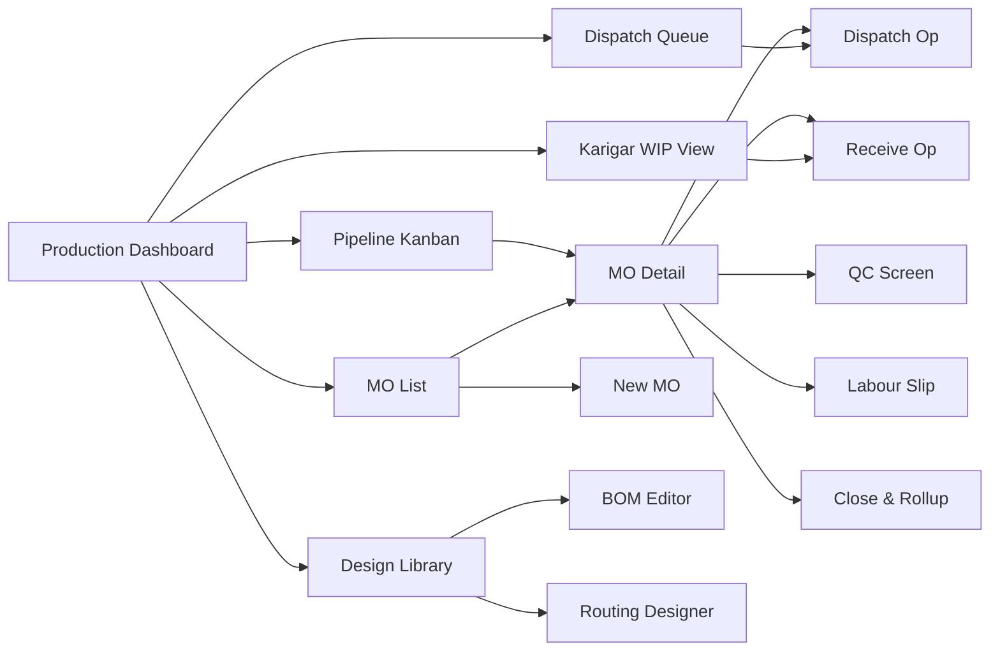

# Manufacturing Module — Screen Inventory (Phase 3)

**Status:** Phase-3 screens, specified now so the full product is visible
**Companion to:** `screens-phase1.md`, `manufacturing-pipeline.md`

---

## Design principles (inherit from `screens-phase1.md` + module-specific)

- **Kanban as home screen** — Production Manager lives on the pipeline view; everything links back to it.
- **One-tap dispatch / receive** — mobile and desktop; must be faster than calling the karigar.
- **Karigar-friendly defaults** — names, photos, WhatsApp first. Don't assume karigar can read English invoices.
- **Events, not forms** — every action is a state transition (receive, dispatch, QC), not a generic "edit and save".
- **Always show cost** — running per-unit cost visible on MO detail, so decisions are margin-aware.

---

## Navigation

---

## Screens

### SCR-MFG-001: Production Dashboard

**Module**: manufacturing / Role: Production Manager, Owner / Permission: `mfg.dashboard.view`
**Purpose**: One-screen read of what's happening on the production floor today.
**Layout**: Header with firm switch + date range; 2×3 KPI card grid; 3-column lower panel (overdue ops, ready to dispatch, awaiting QC).
**KPIs**: MOs in progress (count + avg % complete), Ops ready to dispatch today, Ops overdue at karigars, MOs awaiting QC, WIP value at karigars (₹), Completed this week vs plan.
**Actions**: Create MO (N), Open Kanban (K), Open Dispatch Queue (D), Send karigar reminders (bulk).
**States**: skeleton loading / empty (no MOs yet → "Create your first MO") / error.
**Nav in**: Top-level nav. **Nav out**: Kanban / MO Detail / Dispatch Q.
**Mobile**: KPI cards stack; lower panel becomes tabs.

---

### SCR-MFG-002: Pipeline Kanban (production heart)

**Module**: manufacturing / Role: Production Manager, Owner / Permission: `mfg.kanban.view`
**Purpose**: Live visual map of every piece of WIP across all stages and karigars.
**Layout**: Fixed left nav; full-width scrolling column board — one column per stage (RAW / CUT / AT_DYEING / AT_EMBROIDERY / AT_HANDWORK / AT_STITCHING / AT_WASHING / QC_PENDING / FINISHED / PACKED). Each card = a stock position (MO + karigar + qty).
**Card shows**: MO ref, karigar name (if applicable), qty + UOM, age in stage (days), warning icon if > operation standard × 1.5.
**Column footer**: total qty, total value ₹.
**Actions**: Click card → slide-over with lot details, operation history, quick-action buttons (Receive / Remind karigar / Reassign). Column header → filter by stage. Top toolbar: filters (MO / karigar / design / date range), Bottleneck toggle (color-code by age-vs-standard), Refresh, Export PNG.
**Drag/drop**: disabled (transitions must go through state machine, not drag).
**States**: loading skeleton / empty (no WIP → coaching state) / error.
**Mobile / PWA**: columns become collapsible accordion; each stage shows top-5 cards.
**Keyboard**: `←/→` between columns, `Enter` to open card, `R` to receive, `F` to filter.
**Real-time**: WebSocket push on any `production_event`; auto-refresh on focus.

---

### SCR-MFG-003: MO List

**Module**: manufacturing / Role: Production Manager, Accountant / Permission: `mfg.mo.list`
**Purpose**: Full list of Manufacturing Orders with filters.
**Layout**: Header with filters (status, design, season, date range, salesperson link), data-dense table.
**Columns**: MO#, Design (with thumbnail), Qty planned, Qty produced, Status, Start date, Target date, Days overdue, Cost pool (₹), Actions.
**Actions**: New MO (N), export CSV, bulk-close-ready MOs.
**States**: loading / empty / error / saved-view support.
**Nav out**: MO Detail on row click.
**Mobile**: card list instead of table; essential fields only.

---

### SCR-MFG-004: New / Edit MO

**Module**: manufacturing / Role: Production Manager / Permission: `mfg.mo.create`
**Purpose**: Create or edit an MO in DRAFT state.
**Layout**: 4-section wizard on desktop (Design + Qty → BOM snapshot → Routing override → Review & Release), single-page on mobile.

**Section 1 — Design & qty**:
- Design typeahead (recent / favorites / search).
- Qty split matrix: `{M: 40, L: 40, XL: 20}` with live total.
- Target completion date (default = today + design's lead time).
- Linked SO (optional) — pre-commits output to a sales order.
- Cost centre (optional, defaults from design).

**Section 2 — BOM snapshot**:
- Shows BOM inherited from design, editable per line.
- Material availability indicator (green/amber/red) per line via ATP.
- "Insufficient — Raise PR" shortcut per line.

**Section 3 — Routing override**:
- DAG visualization (inherited).
- Tap any node → change executor (in-house vs karigar), rate, expected days.
- Add/remove ops (audit-logged).

**Section 4 — Review & release**:
- Material reservation preview, cost estimate, on-time probability.
- Actions: Save as DRAFT / Release.

**States**: draft autosave; release with confirmation; rollback on server-side validation failure.
**Shortcuts**: `Ctrl+S` save, `Ctrl+Enter` release.

---

### SCR-MFG-005: MO Detail

**Module**: manufacturing / Role: Production Manager, Operator / Permission: `mfg.mo.view`
**Purpose**: Everything about one MO: progress, operations, materials, costs, events, linked docs.
**Layout**: Sticky header with MO#, status badge, progress bar, cost pool total, key actions. Tabs below.

**Tabs**:
1. **Pipeline** — mini-Kanban showing this MO's ops across stages + a DAG view of the routing graph with each node colored by state.
2. **Operations** — list of `mo_operation` rows with status, karigar, qty, age, actions (Dispatch / Receive / QC / Close).
3. **Materials** — reserved vs issued vs remaining table.
4. **Cost** — live cost rollup (material + labour + overhead + by-product credit) with per-unit estimate.
5. **Events** — reverse-chron event log (every transition with actor + timestamp).
6. **Linked** — source SO (if any), downstream SIs that sold this MO's output, JW orders.

**Actions (context-dependent)**: Release, Start, Partial Close, Close, Cancel, Override Routing.
**States**: Live-refresh on WebSocket.
**Mobile**: tabs stack; Pipeline tab defaults.

---

### SCR-MFG-006: Dispatch Queue

**Module**: manufacturing / Role: Dispatcher, Production Manager / Permission: `mfg.operation.dispatch`
**Purpose**: All READY operations across all MOs, ready to issue.
**Layout**: Single scrollable list grouped by (in-house / karigar). Each row = one op.
**Row content**: MO#, process, executor (karigar + recent performance ★), inputs to issue (item + lot + qty), expected return date.
**Actions per row**:
- "Start" (for in-house) → moves op to IN_PROGRESS, stock transition.
- "Prepare Challan" (for JW) → opens Dispatch Screen (SCR-MFG-007).
- "Reassign" → pick different karigar.
- "Skip" → mark op as skipped (requires reason).
**Bulk actions**: "Dispatch all to K1", "Send reminders".
**States**: empty (no ready ops → "All caught up"), loading.
**Mobile**: card list.

---

### SCR-MFG-007: Dispatch Operation (issue to karigar)

**Module**: manufacturing / Role: Dispatcher / Permission: `mfg.operation.dispatch`
**Purpose**: Prepare outward challan and send to karigar.
**Layout**: Two-column: left = challan preview (editable); right = summary + send options.
**Left (challan)**: date, karigar, process, lines table (item + lot + qty + remarks), expected return date.
**Right (summary)**: total pieces/meters, total value (at current lot cost), e-way bill required (auto-determined), WhatsApp preview.
**Actions**: "Save as Draft", "Issue & Print", "Issue & WhatsApp".
**Post-issue**: stock moves to IN_TRANSIT → AT_<stage>@karigar; challan PDF generated; WhatsApp queued; op → DISPATCHED.
**States**: server-side validation (stock availability, karigar KYC active, rate set) with line-level errors.
**Shortcuts**: `Ctrl+Enter` issue + WhatsApp.

---

### SCR-MFG-008: Receive Operation (inward from karigar)

**Module**: manufacturing / Role: Receiver, Production Manager / Permission: `mfg.operation.receive`
**Purpose**: Record qty returned from a karigar; generate inward challan.
**Layout**: Header = operation summary (expected qty, days at karigar). Body = per-line input.
**Per-line fields**: item, expected qty (read-only), **received qty** (primary input), **rejected qty** + reason, **wastage qty**, by-product qty (if applicable), photo upload.
**Variance indicator**: live-computed `expected − received − wastage − rejected − byproduct`; color-coded.
**Actions**:
- "Receive Partial" — op stays IN_PROGRESS, more coming.
- "Receive & Close" — op → RECEIVED_FULL → QC_PENDING or CLOSED.
- "Receive & Rework" — immediately queue rework op.
**Side panel**: karigar's recent return history for context.
**Mobile**: field size optimized for thumb entry; barcode scan to pre-fill lot.

---

### SCR-MFG-009: QC Inspection

**Module**: manufacturing / Role: QC Inspector / Permission: `mfg.qc.record`
**Purpose**: Record QC results (sampling or 100%) for received output.
**Layout**: Header = operation summary + QC plan being used. Body = per-unit or per-sample grid.
**Per-unit fields**: unit number/ref, pass/fail toggle, if fail → defect code dropdown + disposition (Accept / Rework free / Rework paid / Downgrade / Scrap).
**Sampling mode** (AQL): system auto-picks sample; user records each; final "Lot decision" (Accept all / Reject all / Partial).
**Actions**: "Record & Close Op", "Save & Continue Later".
**Side panel**: photo capture per failed unit; defect code taxonomy help.

---

### SCR-MFG-010: Karigar WIP View

**Module**: manufacturing / Role: Production Manager, Accountant / Permission: `mfg.karigar_wip.view`
**Purpose**: For each karigar, what we've got parked there, value, age, overdue.
**Layout**: Searchable list of karigars with summary columns (pieces held, value ₹, oldest days, overdue count, on-time %, reject rate).
**Click-through**: karigar detail showing every operation currently with them.
**Actions**: "Remind all" (WhatsApp), "Escalate" (flag for legal / visit).
**Report-style**: exportable for period-end WIP valuation.

---

### SCR-MFG-011: Labour Slip Entry

**Module**: manufacturing / Role: Foreman, Production Manager / Permission: `mfg.labour.log`
**Purpose**: Log in-house piece-rate or daily-rate labour against an MO operation.
**Layout**: Quick-entry form: date, employee (typeahead), MO → operation picker, qty, rate (default from employee master), amount (computed).
**Bulk entry**: grid for end-of-day bulk logging across employees.
**Actions**: "Save & New" (N), "Approve & Post" (requires supervisor permission).
**States**: pending approval → approved → posted (becomes a voucher line).
**Weekly view**: per-employee weekly earnings (sent via WhatsApp each Monday).

---

### SCR-MFG-012: Design Library

**Module**: manufacturing / Role: Designer, Production Manager, Sales / Permission: `mfg.design.view`
**Purpose**: Browse/search all designs with photos, BOM, routing, recent MOs.
**Layout**: Grid/gallery of design cards (thumbnail, code, name, season, variant count, status).
**Filters**: season, collection, category, active/retired.
**Card click**: opens design detail (tabs: overview, variants/SKUs, BOM, routing, photos, MO history, sales history).

---

### SCR-MFG-013: BOM Editor

**Module**: manufacturing / Role: Designer / Permission: `mfg.design.edit_bom`
**Purpose**: Define or edit the Bill of Materials for a design.
**Layout**: Part-by-part: left = parts of the suit (dupatta, kurta body, sleeve, bottom, lining, trim), right = inputs for each part (item, qty per unit, UOM, expected wastage, optional flag, alternate item).
**Versioning**: BOM has version + effective-from; MOs snapshot at release.
**Actions**: Add part, add alternate, mark optional, save as new version.

---

### SCR-MFG-014: Routing Designer

**Module**: manufacturing / Role: Designer / Permission: `mfg.design.edit_routing`
**Purpose**: Define the operation DAG for a design.
**Layout**: Visual DAG editor — nodes (operations) and edges (dependencies). Drag to reorder, click to edit.
**Node edit**: operation type, default executor (in-house vs specific karigar), default rate, expected days, applies-to-parts.
**Edge edit**: dependency type (FS / SS / PFS with threshold).
**Validation**: cycle detection, orphan nodes, missing input-output connections.
**Versioning**: as with BOM.

---

### SCR-MFG-015: MO Close & Cost Rollup

**Module**: manufacturing / Role: Production Manager, Accountant / Permission: `mfg.mo.close`
**Purpose**: Final close of an MO with cost computation and variance review.
**Layout**: Summary card: units produced, units rejected/scrapped/downgraded, total cost pool, per-unit landed cost, planned vs actual variance.
**Breakdown table**: material, labour (per op), overhead, by-product credit.
**Variance highlights**: over-standard ops, over-tolerance wastage.
**Actions**: "Close MO" (posts final stock journal, transfers WIP → Finished), "Request Approval" (if variance above threshold).
**Post-close**: MO becomes read-only; cost becomes basis for COGS on sale.

---

## Integration to Phase-1 screens

These Phase-3 screens reference existing Phase-1 masters:
- Item / SKU master (for BOM inputs, outputs) — SCR-MASTERS-003/004
- Party master (for karigars) — SCR-MASTERS-001/002
- Stock explorer (for lot picking) — SCR-INV-001
- Cost centre (for MO tagging) — SCR-MASTERS-008
- Voucher list (for tracking MO-generated vouchers) — SCR-ACC-002

The **Sales Invoice entry** screen (SCR-SALES-005) optionally shows "Linked MO" when the invoiced stock traces back to an MO — enabling MO-level margin reports.

---

## Total

**15 manufacturing screens** — closes the gap from `screens-phase1.md` which deferred this module.

Suggested build sequence in Phase 3:
1. MO list + New MO + MO Detail (skeleton) → basic workflow
2. Dispatch Queue + Dispatch + Receive → core karigar loop
3. Kanban → visualization
4. QC + Labour + Close → completion
5. Design Library + BOM Editor + Routing Designer → design-side power tools
6. Karigar WIP, Dashboard → analytics polish
